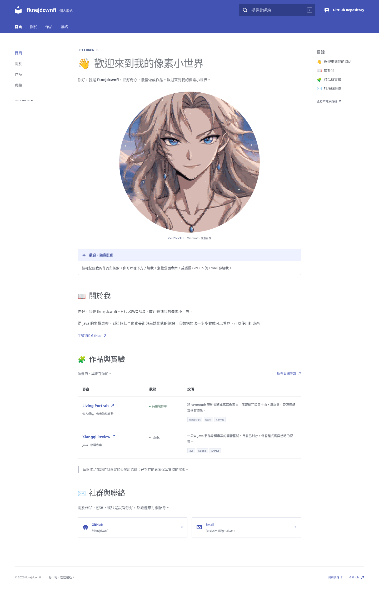

# fknejdcwnfi · 我的像素小世界

**HELLOWORLD**。fknejdcwnfi的個人網站，以高清Minecraft-inspired2D像素圓形呈現Vermouth。

- [正式網站](https://fknejdcwnfi.github.io/website/) · [目前重構指南](docs/guides/poetic-pixel.md)
- [完整不可變原工程](reference-projects/fuji-wind/) · GitHub：<https://github.com/fknejdcwnfi> · Email：**fknejdcwnfi@gmail.com**

72色與原生細像素輪廓保留細髮、樱花枝及富士山；輸出從716×534提升至1432×1068，維持無邊框圓形及原景色，沒有圈外外景。原16個動作錨點不變，在其間估計48份過渡形成50fps，288片三層細雪沿獨立48秒時鐘持續飄落。



[目前圓形](artifacts/poetic-pixel/site/circle.png) · [實際動態預覽](artifacts/poetic-pixel/preview/animation.mp4) · [首屏／逐幀／整站檢查](artifacts/poetic-pixel/site/checks.json) · [來源與高清核對](artifacts/poetic-pixel/assets.json)

初始HTML先播放小型預覽，不等待React及高清圖集；同一video節點按實際播放相位接手高清Canvas。圖集故障仍可保留動態預覽，減少動態／隱藏／離屏及無JS備援保持。原ZIP及22份檔案未修改；原片仍12.5fps，新增過渡是估計影格，高清放大也不能創造原片沒有的資訊。

## 開始開發

使用 `.nvmrc` 指定的 Node24：

```bash
npm ci
npm run dev
```

開發網址為 `/`；`npm run build` 後用 `npm run preview` 檢查 `/website/`。送出前執行：

```bash
npm test
npm run typecheck
npm run build
npm run assets:check
npm run assets:verify
```

任務PR通過檢查後自動合併至 `main`，GitHub Actions負責Pages發佈；擁有者已授權自動更新。`npm run deploy`保留為明確要求時的手動備援，不用它跳過PR流程。

## 改成我的內容

只需先編輯 [site.ts](src/features/profile/content/site.ts)，角色動畫與個人資料互相獨立：

```ts
name: 'fknejdcwnfi',
intro: 'HELLOWORLD',
email: 'fknejdcwnfi@gmail.com',
socials: [],       // 填入你已確認的公開B站／抖音等帳號
gameProfiles: [], // 填入你願意公開的王者荣耀／火影忍者等資料
```

`socials`支援平台、名稱、HTTPS公開網址及可選暱稱；`gameProfiles`支援遊戲、公開暱稱／ID、區服、說明及可選HTTPS連結。沒有資料時不顯示空卡片、遊戲導覽或無效按鈕。需要新增時，參考 [site.example.ts](src/features/profile/content/site.example.ts) 的四個型別工廠與[完整欄位說明](docs/guides/personal-site.md#帳號與遊戲擴充)，填入自己的真實資料；範例檔不由網站載入。

作品只列真實公開repo，`xiangqi-review`如實標為封存。聯絡使用Email／GitHub及設定完成的社群，不使用假送信表單。Press Start 2P字體自託管，附[SIL OFL](public/fonts/OFL.txt)，中文使用系統字體。

## 目錄

```text
src/
  app/                 頁面組合、全站錯誤邊界與基礎樣式
  authoring/           歷史來源轉製工具，不由runtime引用
  features/
    profile/           個人內容、網站版面、靜態HTML與像素UI
    referenceScene/    共用圓形UI／可見性播放器與來源時鐘
    poeticPixel/       現在預設：高清像素、來源過渡、預覽接手及三層細雪
    faithfulPixel/     歷史16幀直接像素轉製
    calmPortrait/      歷史固定人物／小幅後髮rig，不由現在首頁載入
    portrait/          歷史近景播放器，明確入口才載入
  shared/              共用動畫型別
  archive/             legacy／voxel歷史模式及舊field renderer對照
scripts/
  assets/              素材匯出與來源驗證
  qa/                  真實網站截幀、瀏覽器與效能檢查
  tests/               Node單元測試
  deploy/              手動部署備援
reference-projects/    使用者完整工程ZIP、原檔與來源校驗
assets/generated/      歷史生成母版、局部眼瞼與姿態字段，非目前素材
public/assets/reference-scene/  歷史場景素材，不由現在首頁載入
public/assets/poetic-pixel/    現在的原生圖集、高清首幀、首屏影片及來源清冊
public/assets/faithful-pixel/  歷史16幀直接像素素材
public/assets/calm-circle/     歷史固定人物與後髮圖層
docs/
  guides/              現行個人化、角色、動態、開發及素材指南
  archive/             已標示日期的舊階段文件
  reference/           原始委託與分鏡，凍結唯讀
  decisions.md         決策歷史
archive/runtime/       保留但不隨網站打包的舊runtime素材
archive/evidence/      原v2／v4／v5量測與影像歷史
```

`SiteShell`提供共享版面與內容插槽；未來真實功能可組合新區塊並更新靜態HTML，不需要修改髮束rig。詳細路徑見[開發指南](docs/guides/development.md)。

## 動態與驗證

目前預設在`src/features/poeticPixel/`，共用播放器與圓形UI在`referenceScene/`。64×20ms來源過渡維持1280ms原周期與16份原動作錨點，48秒雪場獨立繪製。沒有新母版姿態字段或runtime頭髮變形；只對當前原生圖集幀進行有界像素重建，避免烘焙大型高清全圖集。

[最新指南](docs/guides/poetic-pixel.md)與`artifacts/poetic-pixel/`記錄來源、高清、逐幀、首屏及效能。CI以標準庫獨立解碼核對16原錨點的1,529,376個原生像素鄰域與高清重建；瀏覽器另檢查原幀／估計過渡、雪獨立運動、module阻擋及圖集延遲時預覽仍動、同節點相位接手、減少動態、重試、手機與無JS。

## 素材

`assets/source/**`及`docs/reference/**`保持唯讀。新首頁權威是`reference-projects/fuji-wind/`完整原工程；歷史近景canonical母版仍在 `assets/generated/portrait-v4/`，局部髮後修復在 `assets/generated/portrait-wind/`，runtime為 `public/assets/portrait-natural/`。現在的臉與動作直接取自原動畫，不輪播獨立生成的臉，不使用整圖位移場，也不擴圖成完整胸像。[素材清冊](docs/guides/asset-inventory.md)記錄來源及限制。

貝爾摩德出自《名偵探柯南》，角色權利屬原權利方，本專案為個人非商業粉絲作品。Minecraft為相關權利方商標，本站不是官方合作產品。見[變更紀錄](CHANGELOG.md)。
